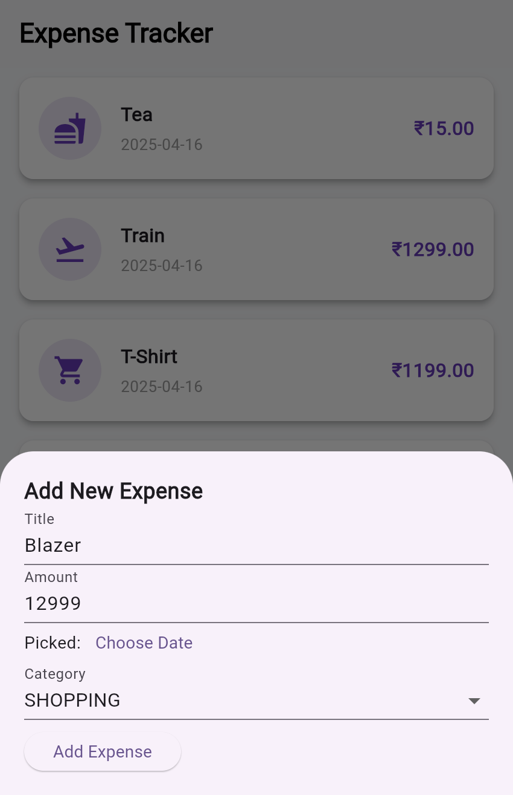
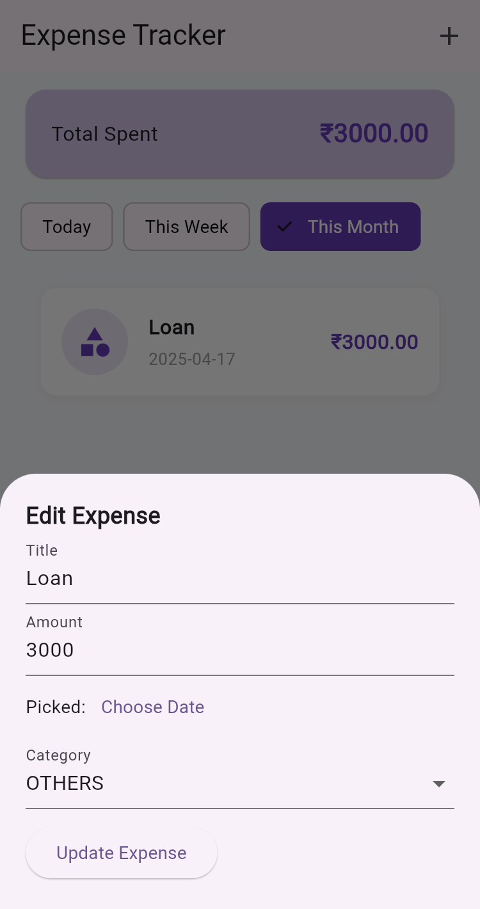
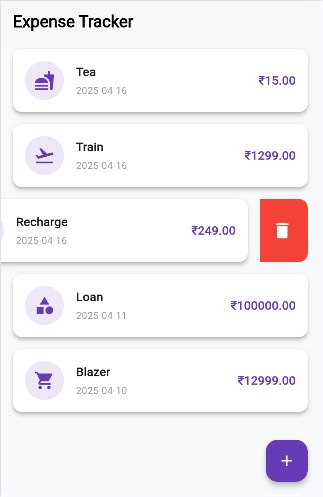

# 💰 flutter-expense-tracker

A **personal finance tracker** app built with **Flutter** that helps users log daily expenses, categorize spending, set budgets, and visualize spending habits using interactive charts. Data is stored **locally using Hive**, ensuring offline access and fast performance.

---

## 📱 Demo






---

## 📜 Features

- ✅ Add, edit, and delete expenses
- 📂 Categorize spending (e.g., Food, Travel, Bills)
- 📊 Visual charts using `fl_chart`
- 💸 Monthly budget setting
- 📅 Filter expenses by date or category
- 🌗 Light/Dark mode
- 🗃️ Local data storage using Hive (offline support)

---

## 🧠 Project Structure

```bash
lib/
├── core/             # Constants and utilities
├── models/           # Hive data models
├── screens/          # App screens
├── services/         # Business logic (Providers, DB access)
├── widgets/          # Reusable components
└── main.dart         # App entry point

## Getting Started

This project is a starting point for a Flutter application.

A few resources to get you started if this is your first Flutter project:

- [Lab: Write your first Flutter app](https://docs.flutter.dev/get-started/codelab)
- [Cookbook: Useful Flutter samples](https://docs.flutter.dev/cookbook)

For help getting started with Flutter development, view the
[online documentation](https://docs.flutter.dev/), which offers tutorials,
samples, guidance on mobile development, and a full API reference.
